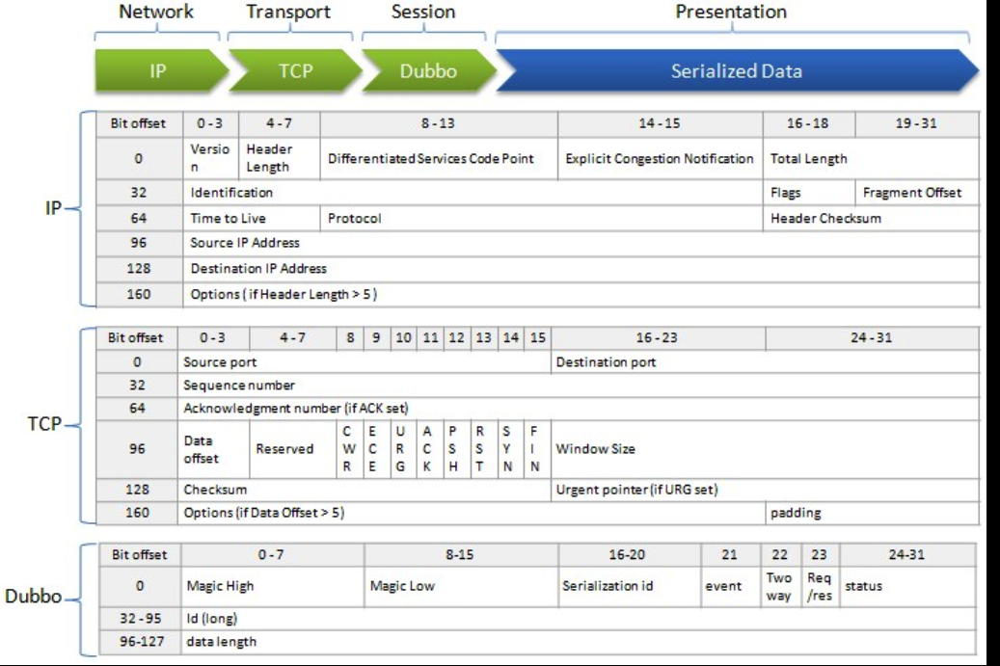
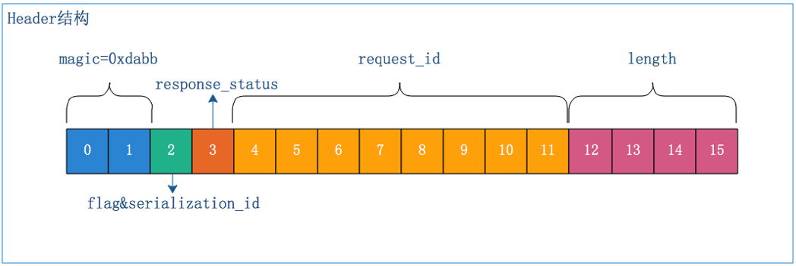
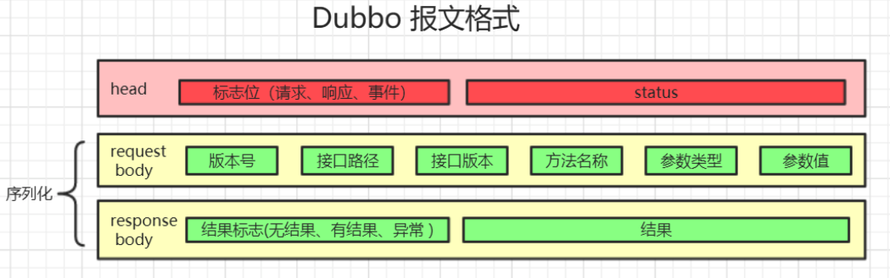
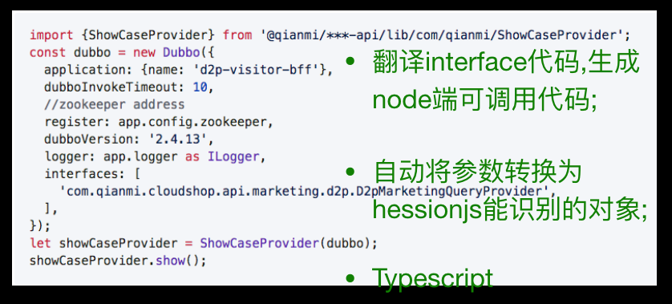
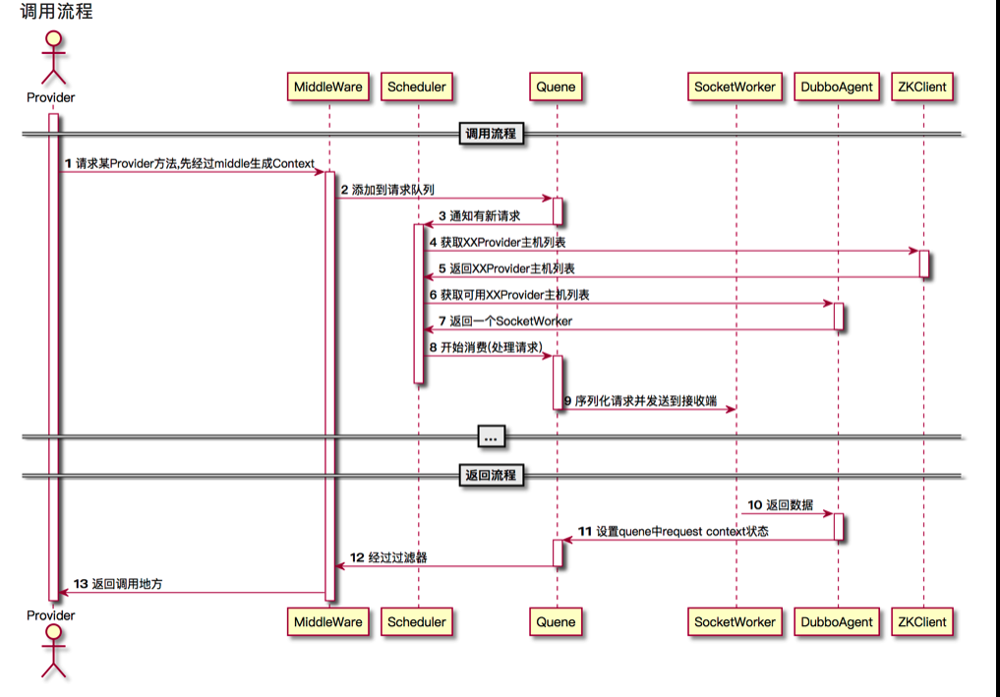

dubbo2js 逐渐落地, 在使用过程中遇到跟踪一些问题,会有些害怕,不知道如何处理,本文来讲解 dubbo 项目相关的概念及源代码解读

## question

让我们先从问题入手,看这些问题,你是否也似曾相识;

> dubbo2js 是什么?
> zookeeper 扮演了什么角色?
> dubbo 负载是如何做的?
> dubbo 服务优雅登机如何做到?
> node 与 dubbo 不是一个技术体系, 如何通信的?

### Q1: dubbo2js 是什么?

dubbo2js 是连接 node 与 dubbo 的一个桥梁. 也可以看做 dubbo 服务的 node 版 sdk;

其本身依赖了 hession.js ,js-to-java zookeeperClient;

[hession.js](https://github.com/node-modules/hessian.js/)

用来解码与编码 hession 协议的字节流;以下两个代码片段也可以看出其作用

Encoder

```javascript
// java code:
// Map<Long, Integer> map = new HashMap<Long, Integer>();
// map.put(123L, 123456);
// map.put(123456L, 123);

var hessian = require('hessian.js');
var encoder = new hessian.Encoder();

// using es6 Map
var map = new Map();
map.set({ '$class': 'java.lang.Long', '$': 123 }, 123456);
map.set({ '$class': 'java.lang.Long', '$': 123456 }, 123);

encoder.write(map); // or encoder.write({ '$class': 'java.util.HashMap', '$': map })
```

Decode

```javascript
var hessian = require("hessian.js");
var decoder = new hessian.Decoder(buf);

decoder.read(); //return what it is
decoder.readNull();
decoder.readBool();
decoder.readInt();
decoder.readLong();
decoder.readDouble();
decoder.readDate();
decoder.readObect();
decoder.readMap();
decoder.readArray();
decoder.readList();
decoder.readRef();
```

[js-to-java](https://github.com/node-modules/js-to-java)

"easy way to wrap js object to java object"

```javascript
var java = require('js-to-java');

// Java: com.java.Object o = new com.java.Object();
java('com.java.Object', { foo: 'bar' });
// => {$class: 'com.java.Object', $: { foo: 'bar' }}

// Java: Boolean r;
java.Boolean(true);
// => {$class: 'java.lang.Boolean', $: true}

// Java: short[] shorts = new short[] {1, 2, 3};
java.array('short', [1, 2, 3]);
// => {$class: '[short', $: [1, 2, 3]}

// Java: int[] ints = new int[] {1, 2, 3};
java.array('int', [1, 2, 3]);
// same to the next example
java.array.int([1, 2, 3]);
// => {$class: '[int', $: [1, 2, 3]}
```

zookeeper

用来做服务发现,负载均衡相关的参数也在这里实现;关于 zookeeper 的详细讲解会在下一个问题详细说明

### Q2: zookeeper 扮演了什么角色?

zookeeper 源于大数据框架 Hadoop,可以用来分布式配置服务,同步服务.其本质是一个目录服务服务,

在 java 体系中使用 zookeeper 来解耦 Provider 与 consumer;
Provider 把接口信息写入 zookeeper, zookeeper 会通知相关的 consumer 同步信息;
借肋于 zookeeper 特性, dubbo 负载,及服务优雅停机都可以做到了;

### Q3: dubbo 负载是如何做的?

查看@2

### Q4: dubbo 服务优雅登机如何做到?

查看@2
还不明白请留言.

## dubbo2js 相关词汇

- hession 协议
  - hession.js
  - js-to-java
  - 翻译师
- 序列化
- Provider
- Zookeeper

#### dubbo 报文格式







#### [翻译师](https://github.com/dubbo/dubbo2.js/tree/master/packages/interpret-cli)



## dubbo2js 解读

###  词汇

- SokcetWorker:与 dubbo 服务所在主机的一个
- socket 连接
- Context:一次 dubbo 服务调用的上下文,与 koa context 概念一致
- RequestId:为发出的请求做一个编号
- DubboAgent:dubbo 服务管理
- Scheduler:调度器
- Dubbo 实例
- Quene:请求队列
- Middleware:中间件

### dubbo2js 发送信息时序图



###常见问题

## 相关信息
ppt
