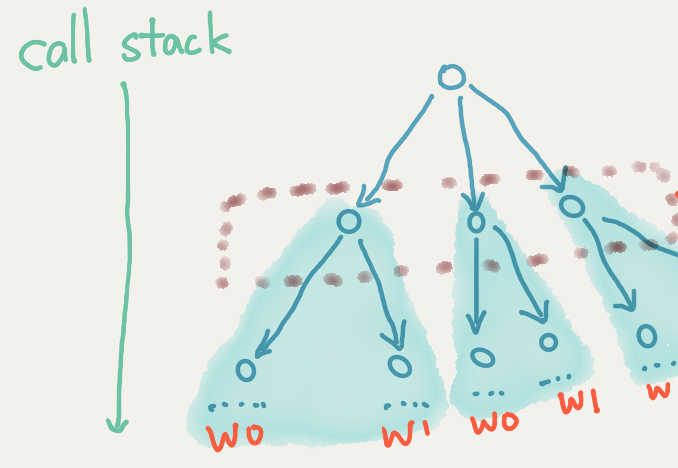

如何在 node 中实现 类似 java 的 threadLocal,react 的 Context?

---

## 是什么

node 8 中引入了新特性 async_hook,一句话概括:"把回调调用的关系体现出来,可以用一棵树形结构来表示回调,并找到父与子的关系";



让我们用一个简单的 api 一窥究竟;

```typescript
//参考https://nodejs.org/api/async_hooks.html

async_hooks.createHook({ init, before, after, destroy, promiseResolve });

// init is called during object construction. The resource may not have
// completed construction when this callback runs, therefore all fields of the
// resource referenced by "asyncId" may not have been populated.
function init(asyncId, type, triggerAsyncId, resource) {}
```

当我们调用一个异步方法时便触发发 async_hooks init 方法(这是 node 底层赋予我们的能力);
init 方法中有两个参数

> "asyncId":与回调函数对应的对象标识 id;
> triggerAsyncId:(调用)声明回调的函数所对应的对象标识符 id;

两者是调用与被调用的关系(父子关系).根据这些 id 值,便可以把 node 程序形象表示为一个棵树(这一点很重要)

node8 中 async_hook 做的很轻只做了这一点,其他丰富的操作要靠我们想像来实现了.

## Terminology

### asynchronous resource

一个与回调关联对象,回调  函数可能会被调用 0 次 1 次 N 次;
例如 net.createServer()中的 connection 事件对应的回调会被调用 N 次,而 fs.open()对应的回调会被调用 1 次,至于 0 次的情况大家可以脑补下.

### AsyncId

仅表示一个 asynchronous resource 对象的 id

### triggerAsyncId

从字面意思理解, 触发|调用 异步的 aync resource Id

### type

异步  资源类型:参数格式为 string 可选值为:

```string
FSEVENTWRAP, FSREQWRAP, GETADDRINFOREQWRAP, GETNAMEINFOREQWRAP, HTTPPARSER,
JSSTREAM, PIPECONNECTWRAP, PIPEWRAP, PROCESSWRAP, QUERYWRAP, SHUTDOWNWRAP,
SIGNALWRAP, STATWATCHER, TCPCONNECTWRAP, TCPSERVER, TCPWRAP, TIMERWRAP, TTYWRAP,
UDPSENDWRAP, UDPWRAP, WRITEWRAP, ZLIB, SSLCONNECTION, PBKDF2REQUEST,
RANDOMBYTESREQUEST, TLSWRAP, Timeout, Immediate, TickObject
```

### resource

resource is an object that represents the actual async resource that has been initialized. This can contain useful information that can vary based on the value of type. For instance, for the GETADDRINFOREQWRAP resource type, resource provides the hostname used when looking up the IP address for the hostname in net.Server.listen(). The API for accessing this information is currently not considered public, but using the Embedder API, users can provide and document their own resource objects. For example, such a resource object could contain the SQL query being executed.

## 应用场景: 隐性传值

在回调中有值共享你会怎么做? 一级一级的传递吗?

熟悉 java 的小伙伴可以回想下 java 的 threadLocal;
熟悉 react 的小伙伴可以考虑下 react 的 context 概念;
在 node 中如何做到呢???? 只能一级一级实现吗?node 中可以借 async_hook 特性轻松实现 node 版本 threadLocal;

有两个库大家可以参考;
[zone-context](https://www.npmjs.com/package/zone-context)
[zone.js](https://github.com/angular/zone.js/)

eg:使用全链路跟踪传递 traceID

## zone-context 解读

async-hook 使我们可以把相关的回调梳理为一棵树,每一个函数都在树的节点上.同时跟树节点对应,我们可以抽取一个存储的树,key 为 async resource ID,
存值时,以当前 asyncID 为 key 存储一个对象
取值时,先从当前 asyncID 对应的存储对接读取,如果没有值,则从 root 存储对象存储;这里要注意两点:

1. 当前节点无存储值则从根节点读取;
2. 是根节点,而不是上级或父节点;

问题: 是否需要改造为向上级寻找,至到找到为止?

## 参考资料

(async_hooks Api)[https://nodejs.org/dist/latest-v10.x/docs/api/async_hooks.html]

(图解 Node.js 之 async_hooks)[https://blog.csdn.net/liuyaqi1993/article/details/78016166]

(Node.js v8.x 新特性 Async Hook 简介)[https://zhuanlan.zhihu.com/p/27394440]
