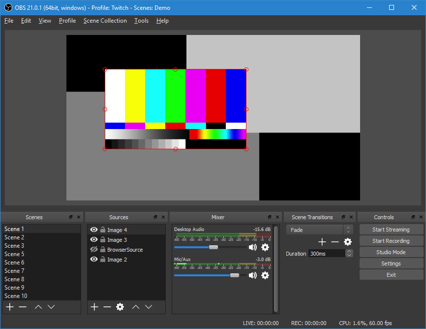
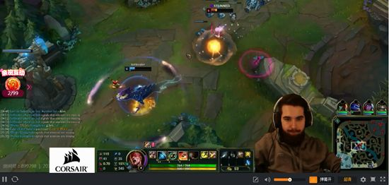
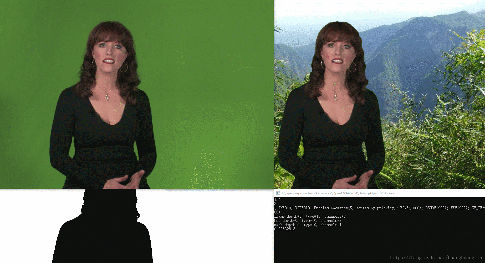

不是为了做网红. 团队内部做分享,需要把视频录制下来,做知识积累. 想做的高大上呢. 所以查资料看看 youtube 上高大上的视频怎么搞出来的. 一查才发现,原来网红这个群体已经把直播工具用到炉火纯青的地步了. 下面进一步了解呢.

在了解文章前 大家最好对图片是什么有一个初步的了解;

## 问题

从一些问题入手,来浅层次了解下相关工具

### obs 是什么

看下[官方](https://obsproject.com/)描述:"Free and open source software for video recording and live streaming."
从这句话我们知道 他是用来做视频录制,可以生成直播流的工具,是一款开源软件,当前斗魚等直播平台 都是在这个基础上进行开发;该软件官方文档 支持 16 国语言,可见其流行程度;

[feature](https://obsproject.com/):

1. 高性能实时视频音频捕获与合并;
2. 视频数据来源广;
   可以从图片, 文本,浏览器,屏幕,摄像头等获取视频流;
3. 多场景化,无缝切换;

4. 可以实时播放;
   (推流)将本地生成的视频流实时推送到 youtube,mixer, 优酷,斗鱼等视频平台,其他人可以直接收看,后面又可以看录播内容;
5. 合成视频布局自定义处理;
   通过简单的可视化拖拽实现多个视频的布局
6. 插件机制可扩展;
   强大的程序猿通过编写脚本插件等实现定制功能;
7. 多平台支持, windows mac linux 支持;

### obs 直播摄像头透明背景怎么弄

经常在 youtube 上看到下图类似的视频,人物  跃然纸上,又很少影响讲解内容的地方; 如何做到呢?

简单来说,把有绿幕的视频流逐帧做"扣图"处理, 然后与另一视频源合并;将处理过程可视化便可见下图

[图片绿幕处理算法](https://blog.csdn.net/huanghuangjin/article/details/81461040)

 做为一个程序员,  肯定要死磕到底,如何实现这一流程呢?

我们的第一印象,图片由像素组成的,将特征点(绿幕)逐一判断,如果符合就设置为透明.这样就需要两个循环,多层循环视频流里每一  帧图像,内层  循环  图像的每一个像素点,如果在阀值范围内,则设置为透明;

代码很简单, 当然如果你写下去会发现  效率极差. 哈哈.  
其实这个逻辑 openCV 已经给我们做到了封装,其算法都是通过  矩阵运算,故性能有所保障;
其两个步骤便可实现

1. 通过  阀值与源图片文件得到图像掩码(二值化,即下图中的黑白图);
2. 将掩码从源图像中获取透明效果图,再将透明效果图与另一视频源做合并 处理即可;

[OpenCV 之图像分割(六) 绿幕背景视频抠图](https://blog.csdn.net/huanghuangjin/article/details/81461040)

[绿屏抠像教学](https://zhuanlan.zhihu.com/p/34608752)

### 插件实现

(obs plugins 官方文档)[https://obsproject.com/docs/plugins.html]

偷个懒 这块暂时没用到,后面再看

### 有那些插件

[斗鱼相关插件](http://www.obsapp.com/apps/)
[斗图](http://www.obsapp.com/article/4173.html)

## 相关资料

[obsapp](http://www.obsapp.com/)
[obs 官网](https://obsproject.com/)
[obs 中文网](http://www.obsapp.net/)
[obs+node-media-server+flv.js 实现录播和直播](https://juejin.im/post/5b14cacae51d45068b495725)
