## Personal Information

* name：杨晓东
* birth：1987-07-29
* github：https://github.com/
* blog：https://creasy2010.github.io/

## About me

9+年工作经验，涉及前后端数据设计等方面;

在工作中非常有幸接触并实践了前端工程化，数据分析，灰度，自动化测试&运维等理念，

感谢那些一起的奋战的朋友们，

在余生希望自己不断提高认知，做一个有趣的人;

接下来的两年希望自己能在图片处理,机器学习方面有所积累;

## Work Experience

* 2014.6-now 江苏千米网络科技有限公司
* 2013.10-2014.6 江苏聚智网络科技有限公司
* 2010.8-2013.10 神州数码科技有限公司

## Skill

* Frontend：React & ReactNative & Babel & Typescript & Webpack
* Backend： node.js & java
* DataBase： mysql & oracle
* other： GoogleAnalyse Python

## Project Experience

### dubbo2js Project

#### 解决问题
[dubbo2js](https://github.com/dubbo/dubbo2.js)以 hession 协议无缝打通 node 与 dubbo 通信!
[Apache Dubbo™](http://dubbo.apache.org/zh-cn/index.html)
(incubating)是一款高性能 Java RPC 框架，阿里巴巴内部孵化，目前活跃在各大公司中台．千米也选择 dubbo 作为中后台基础技术 ，在千米前端技术演进中逐渐选择 node 作为 bff 层开发框架， 所以 node 与 dubbo 无缝打通，就成了重中之重了．

#### feature

1. 原生打通：在 tcp 长连接作为数据通道，以 hession 数据格式进行通信;
2. 服务发现： 支持 zookeeper 作为注册中心;
3. middleware 机制：易于扩展;
4. 全链路跟踪：打通 opentrace zipkin 等跟踪框架，出现问题时易于定位;
5. 开发人员无缝对接：翻译师根据 java 接口 class 文件分析出抽像语法树(ast)，再将其转化为 typescript 抽像语法树，最终生成 ts 文件，供应用调用;

#### 现状
 dubbo2js 已被[官方接纳](http://dubbo.apache.org/zh-cn/community/index.html)，并随 dubbo 进入 Apache 开源孵化器，另外 dubbo2js 也在各公司落地，start 数量 即将突破 300

#### 相关图片

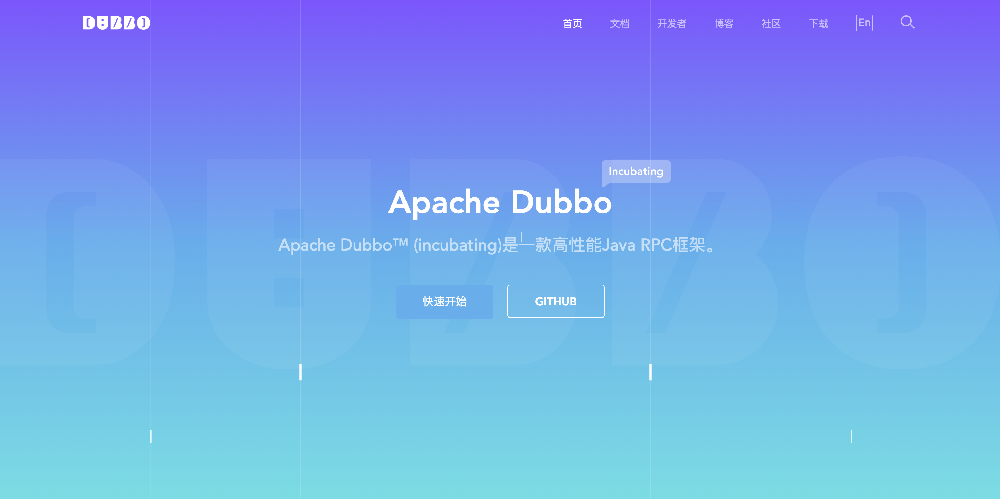

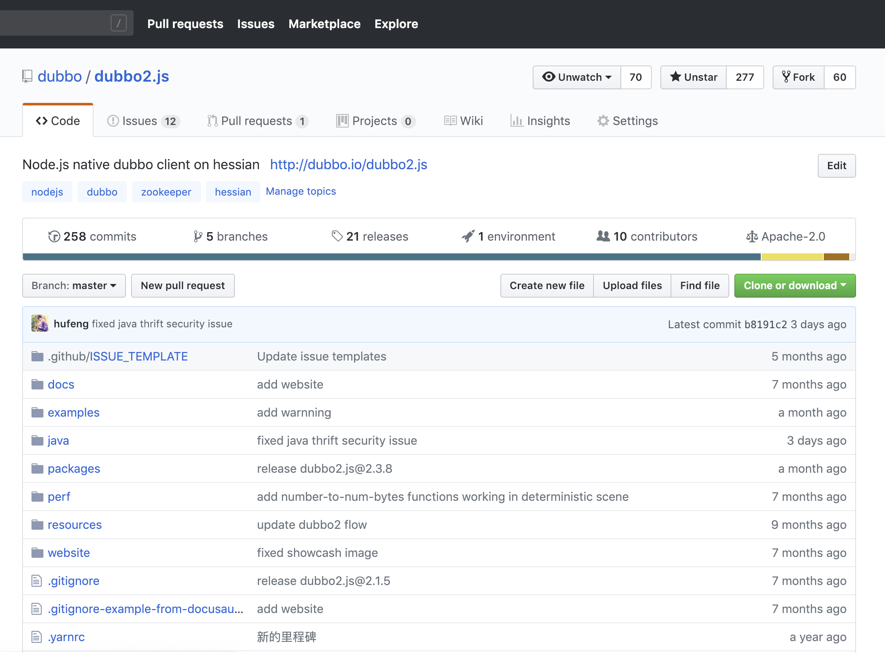

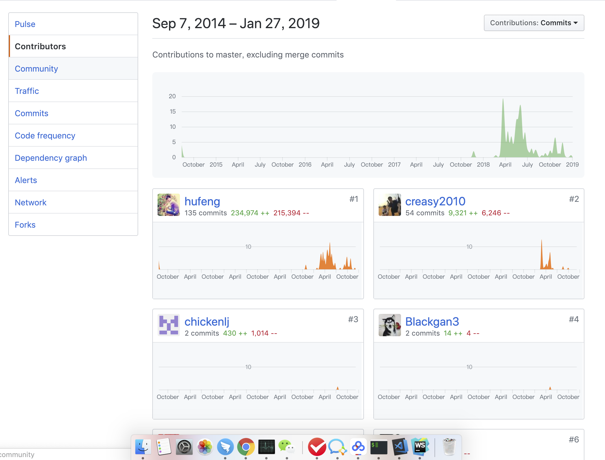

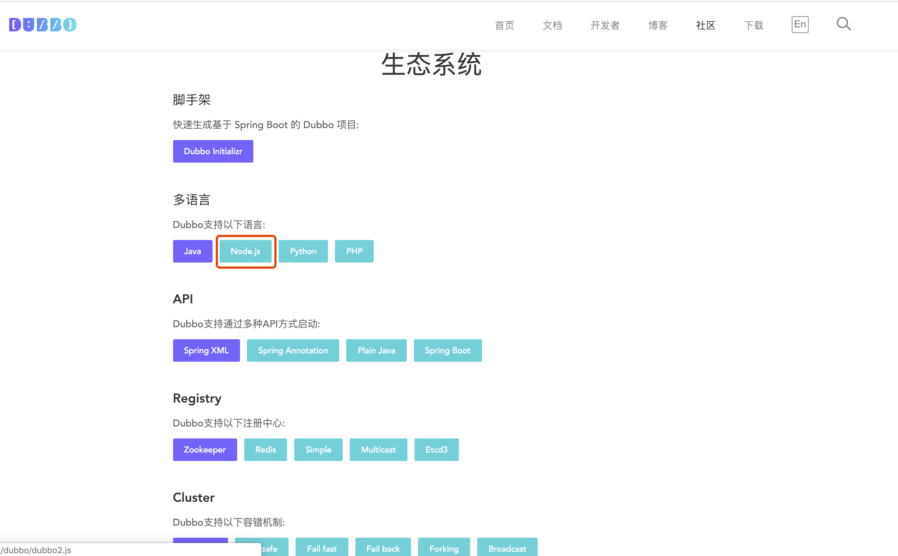

### 魔方建站 Project

#### 解决问题
建站工具，解决saas平台用户UI个性化定制，实现千人千面

#### 背景
如果一个建站工具，开发不会调，测试不能用，售后用不好，客户用的发脾气，产品经理摸不着头脑怎么办? 推翻他，解放人们!

魔方建站正是基于这么一个背景，在一场24H不眠不休的hackathon比赛中横空出世;

从一个创意原型到支撑各个业务线，支撑多平台，拥有丰富的精品组件，我们走了两年的时间;

速度优化上精益求精，把发布时间从120秒，下降到20秒，15秒 ，1秒，100毫秒，每一次突破，都让我们兴奋不已，每一次也都迫使我们提高对技术的认知

组件上越来越精简丰富，万能热区组件，商品列表组件，freestyle组件，每一个都让我们热血沸腾，激情澎湃;

支持平台越来越全面，从pc出发，拿下微信端，攻克rn移动端，每一次都让我们对未来充满憧憬; 

责任越来越大，从商城业务线孵化，支撑供货产品线，家政产品线，万米事业部，每多一条产品线，都是对2年积累的认可;

#### feature

1. 多平台支持：支持pc web app 建站; 
2. 平台联动： 一套模板，编辑一处，多平台生效; 
3. 丰富的精品组件：自定义布局，多种营销组件，图片组件;
4. 易于扩展：对接产品线研发人员，可以自己开发组件，发布到我们组件库中，配置成模板便可上架，供用户使用;
5. 简单：没有任何经验的商户，5分钟便可可配置出精品的页面，没有任何开发技能的UI便可配置模板上架;
6. Saas化服务： 简单对接，3天便可调试，5天便能上线

#### now
魔方建站已经 在内部支撑多条产品线，举一个例子，万米一套20W的系统加了建站功能可以卖出30W的价格;

非常遗憾的是,未到实施我们"走出云的战略";另外对小程序的支持还没进行下去;

#### 相关图片

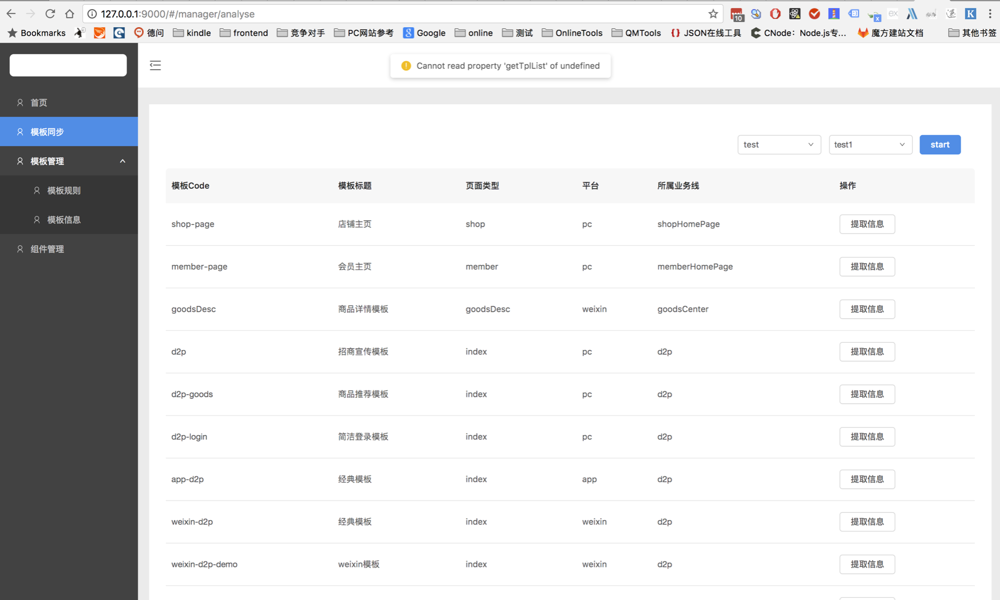

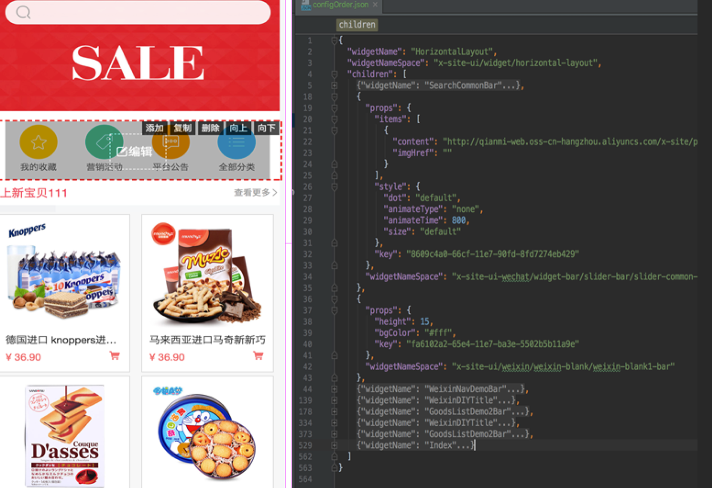

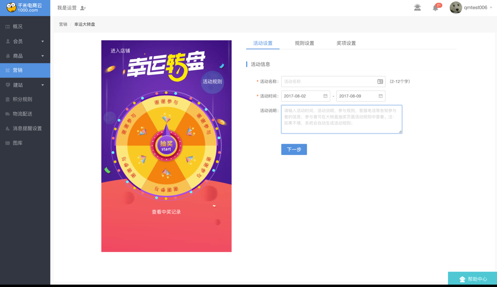

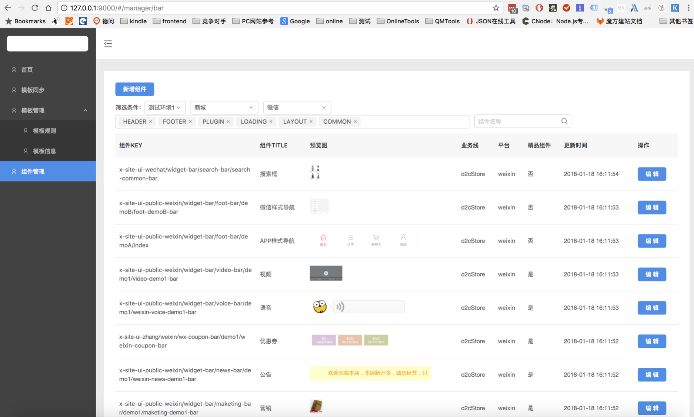

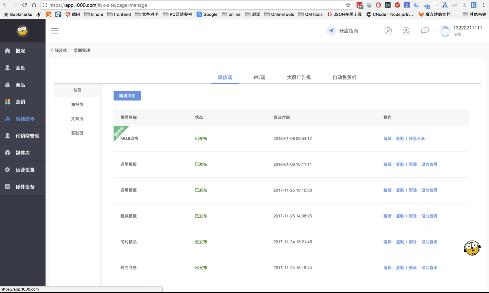

### rn-boat  Project
TODO

### 云小店(产品线负责人) Project
TODO

### 云商城  Project
TODO

### 商品中心  Project
TODO

### 华泰证券监控 Project
TODO

### 华泰证券自动化 Project
TODO

## 美好瞬间

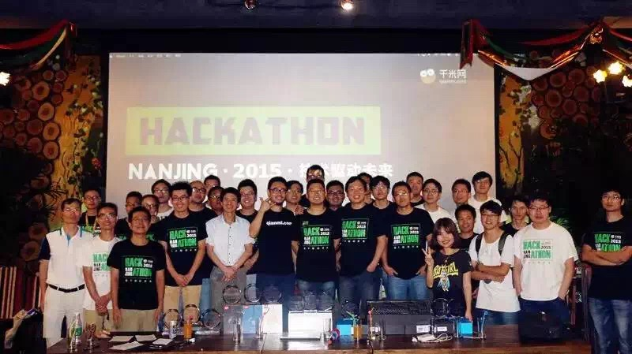

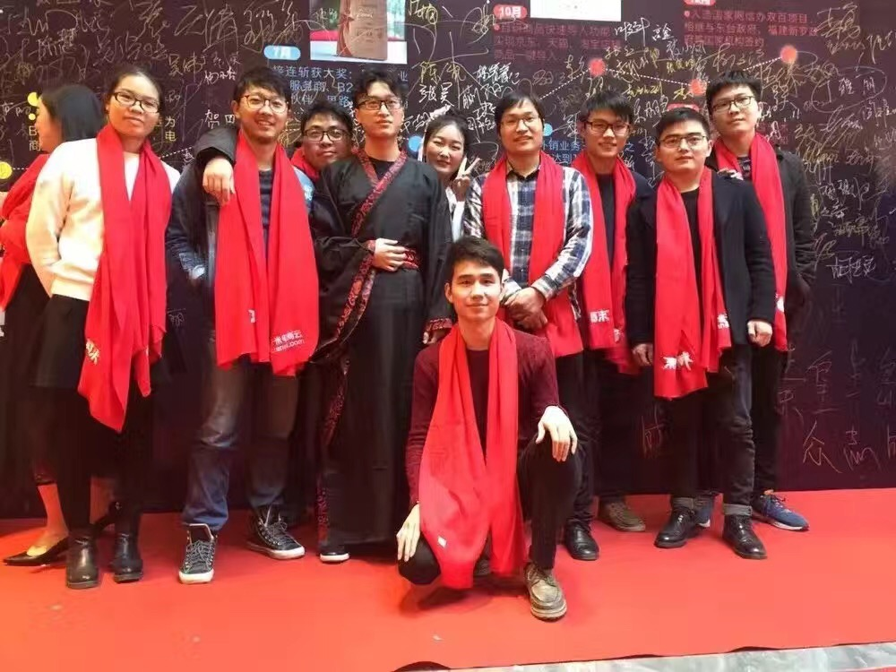
 

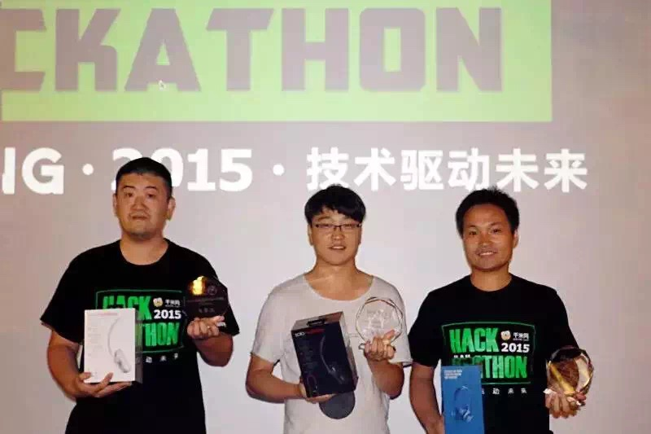

