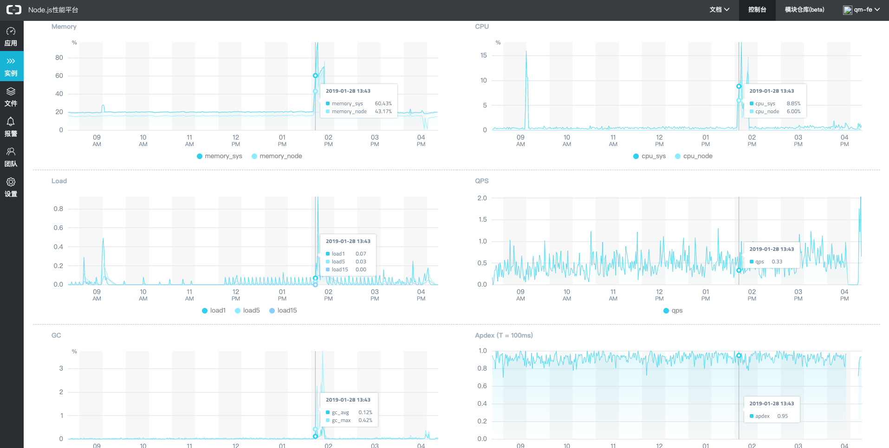
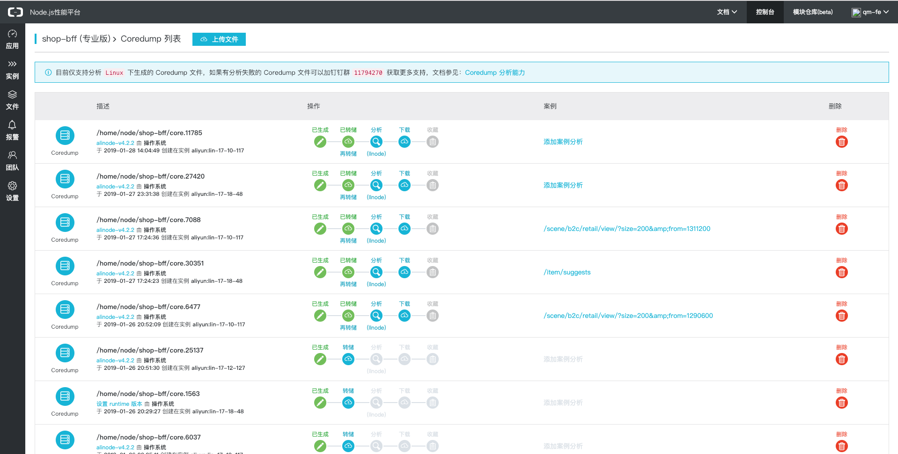
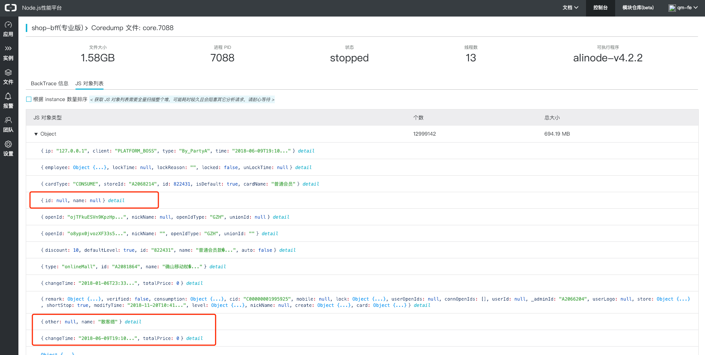
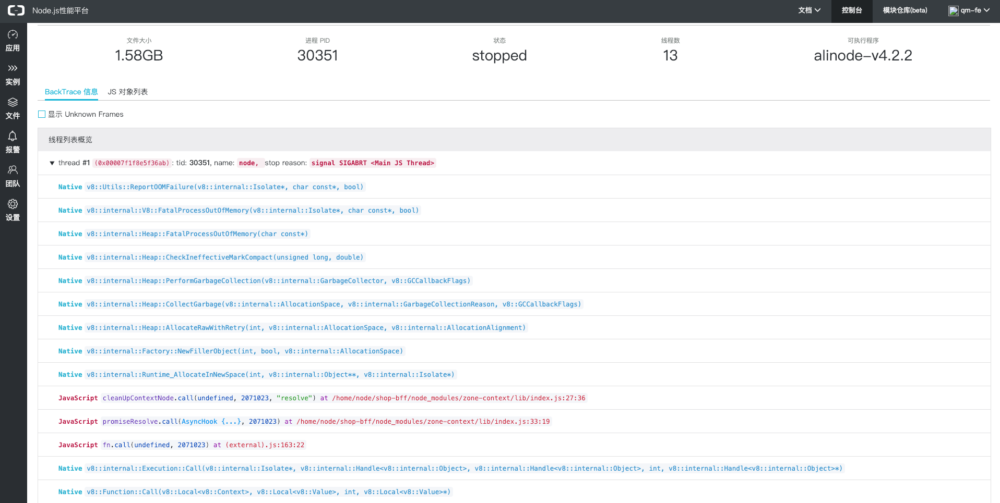
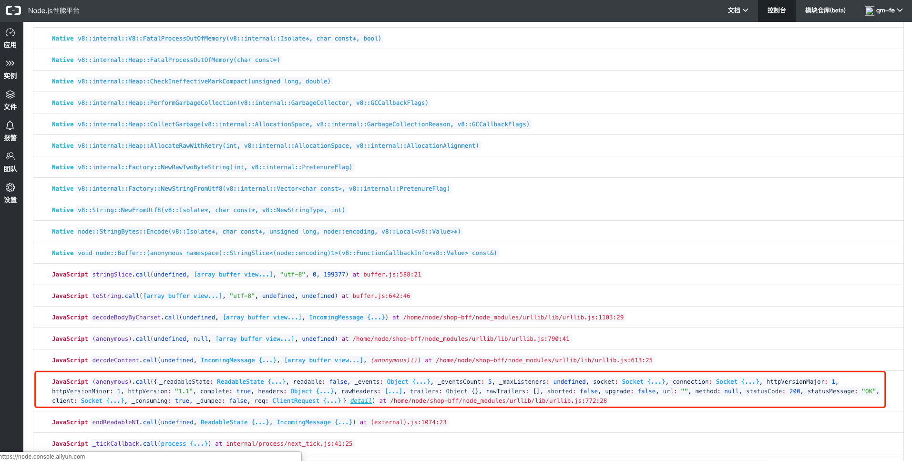
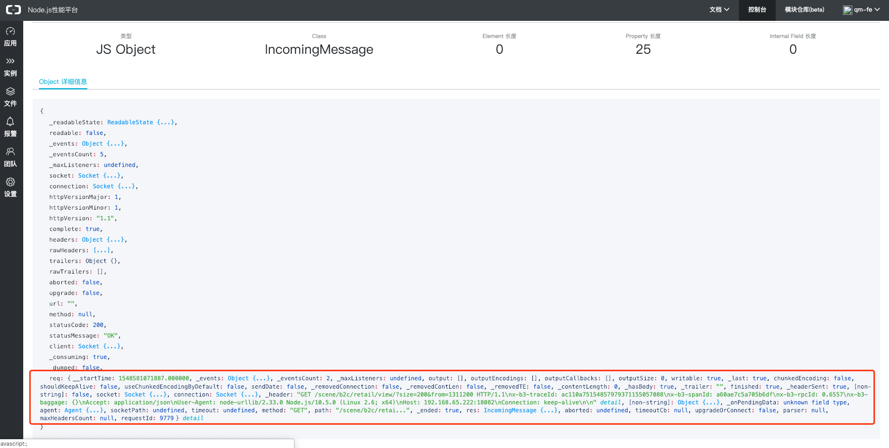
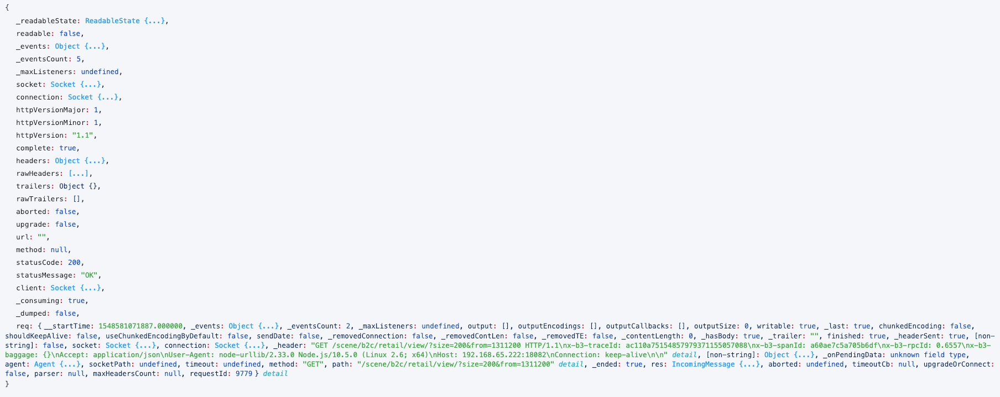
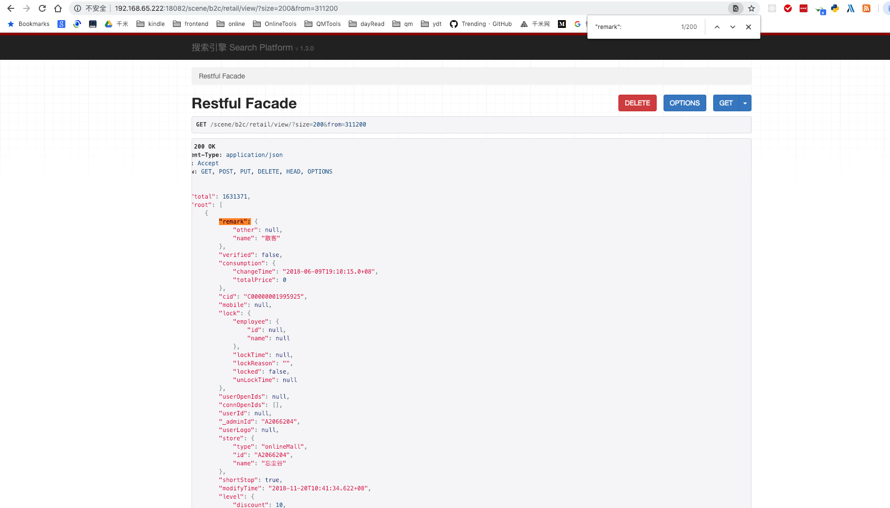
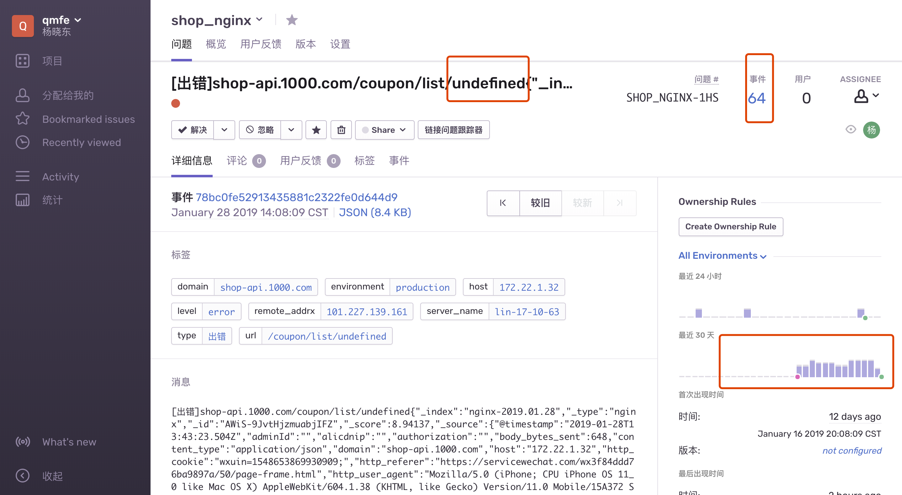
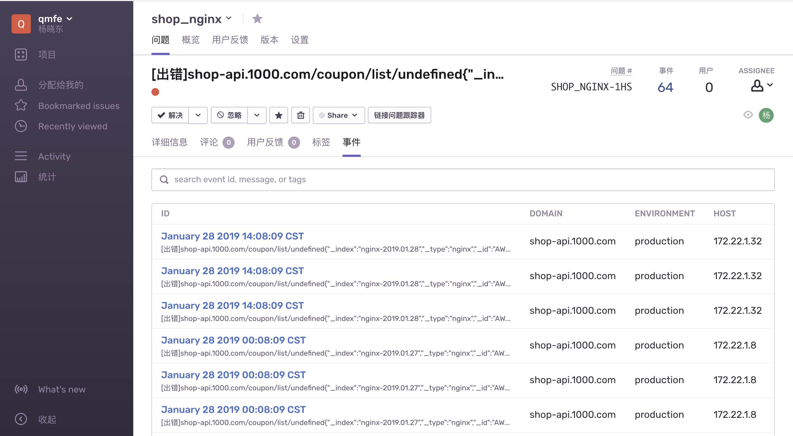

bug还没解决，如何过年?

不是标题党，确实是出了线上问题，线上不间断出现oom问题，还有一周就过年了，问题不解决，如何能安心过年，过年的时候出问题，估计客户会把我们撕的碎碎的.

为什么说 "5块钱的bug，怎么用了1.5W的成本?" 数字列的有些夸张了，但如果及早发现这个问题，一个人5分钟就搞定，但我们三个人却用了5天(包含周未);

## 现象

在"发现问题行动"的推动下配置了alinode的告警，然后就有报警出现了. 

报警: "已用堆内存超过堆上限的 80%，当前为 82.31%";

再仔细一查，不得了了.比报警内容还坏，我们遇到的不是内存泄漏，而是oom崩溃，而且是突发式的.一但发生立马崩溃，不给你半点时间; 
幸好进程会自动拉起. nginx也有健康状态检查，会自动分流; 



随后开启服务器coredump，把进程崩溃的现场信息留下来，等了一天，便可以在alinode管理端获取coredump列表.



有了这些信息，就可以开展分析工作了;

## 线索

1. 崩溃不定期发生，然而线上机器大概率发生，灰度 机器并不发生;一台机器中个别进程崩溃;
2. 查看其他应用并没有发生崩溃的问题; 
3. 近期上了健康检查与全链路跟踪; 
4. 线上虽有崩溃，然而并没有用户反馈有问题;
5. 有3种崩溃的情况，不只是一种;

## 解决角度

根据对coredump内容分析，有三个解决角度

1. 查看heap中占比最大的对象;
2. zoneContext导致;
3. urllib所发出的请求导致出问题; 

看了之后特别怀疑问题2，原因有两点: 

1) 最近我们上线了zipkin全链路跟踪;
2) zoneContex 所使用的async_hook还是实验特性 (不会入坑了吧. );
3) nginx有健康检查，会不停发请求; 


但还是选一个软柿子捏."查看heap中占比最大的对象" 这个最容易解决

### 线索1:查看heap中占比最大的对象

本以为手到病除，然而一看coredump中对象列表就傻眼了.没有统计，没有规律，只显示object有600多M，但是什么对象就是找不到.
就好比告诉你凶手就在茫茫人海中，说了几乎跟没说一样.. 😱



尝试用概率的方法来人肉统计一次，然而次次无功而返;当然可以不依赖alinode对coredump进行分析，然而考虑到时间成本再试下别一个角度😤


### 线索2:zoneContext导致
 
朝着这个方向走，检查了zonecontext的代码，然而并没有看出什么问题，只好忌出大法(范围缩小跟踪)

我们使用zonecontext的地方有两个，1) 全链路跟踪，2) dubbolog . 而 全链路跟踪是新上的功能，且是关键节点，dubbolog记录是很久上的，且业务应用也有使用

我们选择关闭了zipkin全链路跟踪，关闭了nginx健康检查(会发送大量请求); 


理想总是美好的，然而实现却啪啪啪的打脸. 把这些都关闭了线上还在出问题;囧了. 众多迹象证明问题不在zonecontext&async_hook😤






### 线索3:urllib所发出的请求导致出问题


根据报错信息组装并打开urllib发出的请求，可以看到请求(http://192.168.65.222:18082/scene/b2c/retail/view/?size=200&from=311200)的具体信息，里面有几点是非常可疑的👀 . 

1. 门店查询为什么没有店家编号; 
2. 从311200即1556页开始查询，那个用户会能这么无聊;
3. 查询这么多就是没有什么意义的;

基于这个线索我们深入查看了代码.  终于剥开迷雾; 在查找代码后发现这段逻辑中有嵌套调用，无限循环; 


```typescript

  /**
   * 根据ticketId查询查询店铺列表
   */
  public async shopListByPhonenum(phonenum: string, pageSize: number = 200, pageNum: number = 0) {
    const ticketId = await this.ctx.service.ucFetch.fetchTicketIdByPhonenum(phonenum);
    const { ES } = this.ctx;
    let dataList = [];
    const esRes = await ES.pagingQuery<IConnectionInfo>({
      router: `${ES.routers.SCENE_RETAIL_SHOP}/`,
      pageSize,
      pageNum,
      terms: {
        prop: 'userId',
        value: ticketId,
      },
    });
    dataList = dataList.concat(esRes.dataList || []);
    if (esRes.totalCount - 200 > 0 && dataList.length > 0) {
      const shopList = await this.shopListByPhonenum(phonenum, pageSize, pageNum + 1);
      dataList = dataList.concat(shopList);
    }
    return dataList;
  }

```

当通过手机号能查询到用户时，一切正常，而当通过手机号查询不到用户时，便变成了查询所有店铺列表;



  把url拼装后发现得出结果


## 回顾

如果是一个请求造成了，内存暴增，我们可以推断，有用户发送的http请求会中断 ; 然后我查询了nginx监控日志 (近期刚做监控，还没全面推广)
通过图发现确实是如此，而且最后一个参数为undefined; 虽然马后炮没什么用，但如果能解决这个问题，可能就不会有这么一遭经历了. 

我们再来验证下线索:

"崩溃不定期发生": 是因为有用户触发此请求才会导致，而且只有一个node进程崩溃;

"没有用户反馈": 此功能非重要页面，用户会重新刷新，退出; 

"有3种崩溃的情况，不只是一种": 嵌套调用有时间间隔(异步) ，有可能此时dubbo正好返回，导致内存撑爆，故而3种情况甚至更多情况都会出现，只要有申请内存操作的都有机率出现; 






## 小结

* 重视线上报错告警信息，每一个错都是一个潜在的雷，不排除，就被炸，问题越早发现处理成本越低，处理起来越简单; 
* 重视代码规范(价值观)，各环节的参数校验要到位，现在没问题不代表以后没问题; 
* 各个环节的监控要配置到位;
* 现场只告诉你信息，原因要结合场景进行一些推断，工具是还没那么智能的告诉你那里出问题了; 
* 工具链非常重要，进程崩溃没有引发大范围业务问题，问题相关的定位太感谢相关的工具(alinode lldb sentry logserver，bugatti dubbo2js zonecontext)，好的工具链能营造一个好的开发体验，让我们便捷的去解决问题;


## 参考文章

[Node 案发现场揭秘 —— Coredump 还原线上异常](https://zhuanlan.zhihu.com/p/41178823?spm=a2c4g.11186623.2.23.31636df2AekZJO)
[Node.js 调试指南](https://www.bookstack.cn/read/node-in-debugging/2.1gcorellnode.md)


