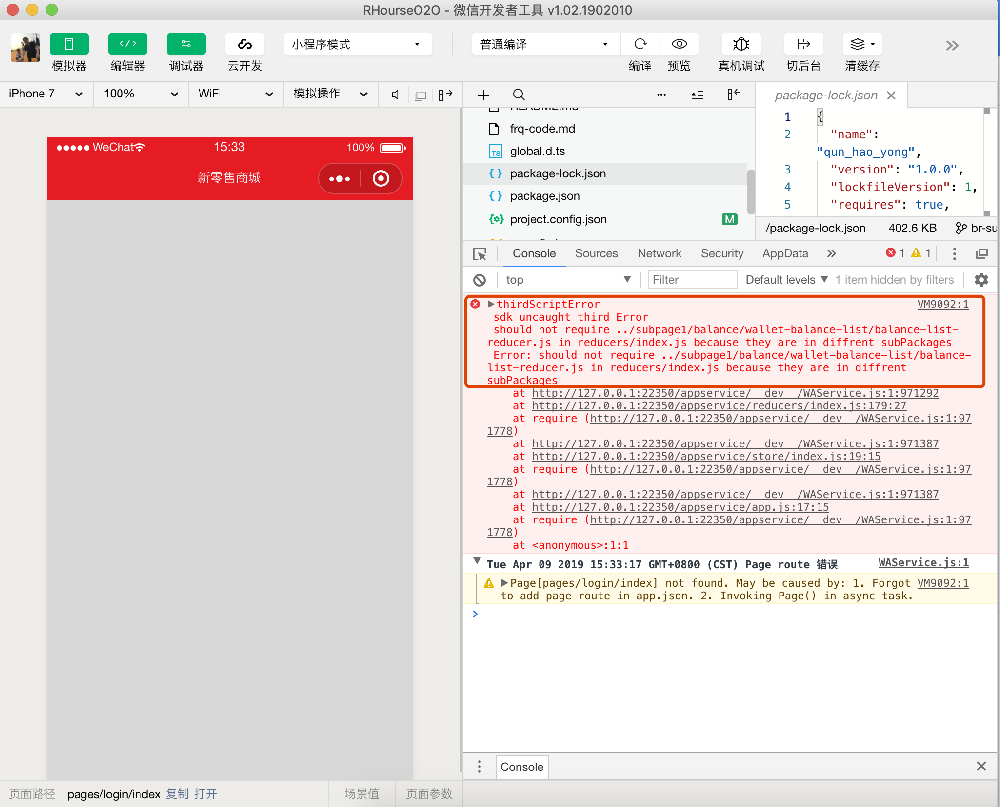

## 背景

最近在用taro写小程序，写着写着，小程序就从小变大了.  二话不说直接分包.

梭完代码， 以为不过如此时，然后打开模拟器就报错了..  



分包原则:"子可依赖主，主不能依赖子";

简单分析了下，项目中redux中每个(类)页面都有相关联的reducer;而在改造分包之后代码结构如下: 

主包文件reducers/index.ts引用了所有页面的reducer.ts 故而出现报错-主包依赖子包;

```
.
├── api
├── app.less
├── app.tsx
├── config.ts
├── iconfont.less
├── index.html
├── pages
│   ├── after-sales
│   │   ├── action.ts
│   │   ├── constant.ts
│   │   ├── index.less
│   │   ├── index.tsx
│   │   ├── reducer.ts
│   │   └── types.ts
│   ├── ... ...
├── reducers
│   └── index.ts
├── store
│   └── index.ts
├── subpage1
│   └── balance
│       └── wallet-balance-list
│           ├── action.ts
│           ├── balance-list-reducer.ts
│           ├── components
│           │   ├── list.less
│           │   └── list.tsx
│           ├── constant.ts
│           ├── index.less
│           ├── index.tsx
│           └── types.ts
│       └── .......
├── types.ts
```


问题就是这么个问题，怎么处理呢?

 
## 解决方案: 


###  方案一:  把子包reducer聚合到主包; 
这个难度最极低， 一眨眼的工夫应该就完成了;
然而我们为什么把reducer聚合在一个页面或一类页面?

高内聚: 把业务相关的内容放在一起，这样操作方便，理解简单，避免写一个方法在不同的文件夹切来切去.


###  方案二:  分store;

即主包走主包的store， 分包走分包的store， 这样一个项目最大四个store;

写一个高阶函数提供一个provider， "包裹"子页面， 子页面从不同的provider，不同的context取数据

方案也走的通， 但总感觉不对， 与redux的"单store"理念渐行渐远，与其这样不如使用多store框架了，而且写起来也很别扭. 

注: (每个页面一个store，就不要想了， 走多store方案，还简单，干嘛自己跟自己过不去)


于是 看了redux的源代码， 一行注释，终于让我找到了最理想的方案--"load some of the reducers dynamically"; 

```
/**
   * Replaces the reducer currently used by the store to calculate the state.
   *
   * You might need this if your app implements code splitting and you want to
   * load some of the reducers dynamically. You might also need this if you
   * implement a hot reloading mechanism for Redux.
   *
   * @param {Function} nextReducer The reducer for the store to use instead.
   * @returns {void}
   */
```

### 方案三 : 动态加载reducer;
 废话不多说， 两步走. 
 1. 在主store中添加动态注册方法; 
 2. 在子页面中添加注册即可. 
 
 talk is cheap， show me the code !
  
 
```typescript

//store 定义
const enhancer = composeEnhancers(
  applyMiddleware(...middlewares),
  // other store enhancers if any
);

let GolbalStore = createStore(combineReducers(mainReducerMap), enhancer);

// 注册新的reducer
export function registerReducer(reducerMap: {[name: string]: Function}) {
  //判断是否重复.
  for (let key in reducerMap) {
    if (mainReducerMap[key]) {
      throw new Error(
        `the register reducer conflict with reducer name: ${key},please modify the reducer name`,
      );
    }
  }

  GolbalStore.replaceReducer(
    combineReducers({
      ...mainReducerMap,
      ...reducerMap,
    }),
  );
}

export default GolbalStore;
 ```
 
  
 
 ```typescript
  
import './index.less';
import {IBalanceWalletBalanceListProps} from './types';
import actions from './action';

import List from './components/list';
import { registerReducer } from "@/store";
import balanceWalletBalanceList from './balance-list-reducer';

//注册页面reducer. 
registerReducer({balanceWalletBalanceList});

@connect(
  ({balanceWalletBalanceList}) =>
    ({
      balanceWalletBalanceList,
    } as any),
  actions,
)
class BalanceWalletBalanceList extends Component<
  IBalanceWalletBalanceListProps,
  any
> {
  config: Config = {
    navigationBarTitleText: '余额明细',
  };

  componentDidMount() {
    this.props.init();
  }
  
  ```

  
结束 are you ok  ? 

## 总结: 
  自己首次使用redux对api不熟悉，所以没有一开始想到动态加载方案， 可见限制一个人的还是认知;
  
## 问题:
 
### 动态加载会不会使用store中的数据改变或抹除?
 不会， 具体可以看代码 :  
 https://github.com/reduxjs/redux/blob/master/src/createStore.js#L228
 https://github.com/reduxjs/redux/blob/master/src/combineReducers.js
  
 新加载的reducer只是计算逻辑，无状态， 所以删除，添加，更换逻辑上都是可以的. 
 
## 参考资料

[分包加载](https://developers.weixin.qq.com/miniprogram/dev/framework/subpackages.html)
[基于Taro开发小程序笔记--02项目结构梳理](https://www.cnblogs.com/zjlx/p/10275445.html)

