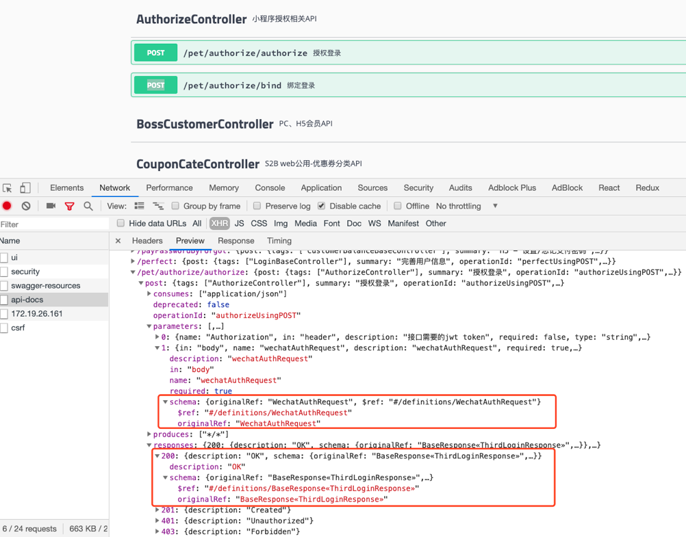
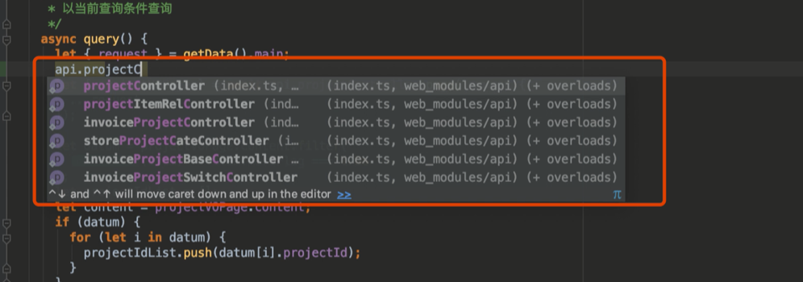
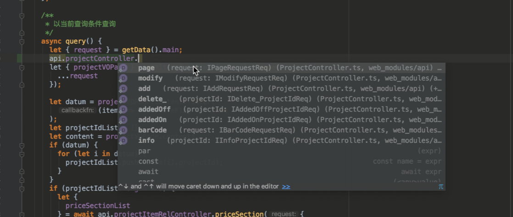
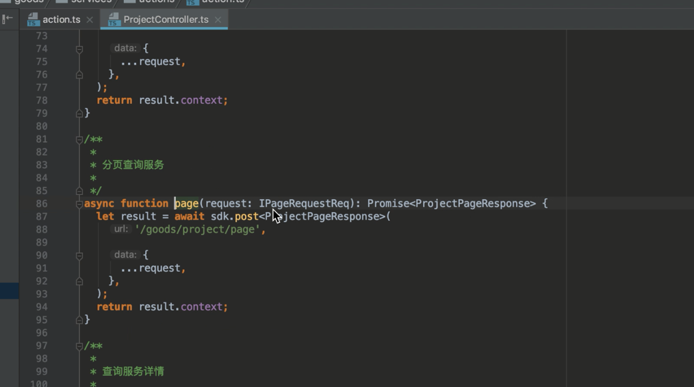
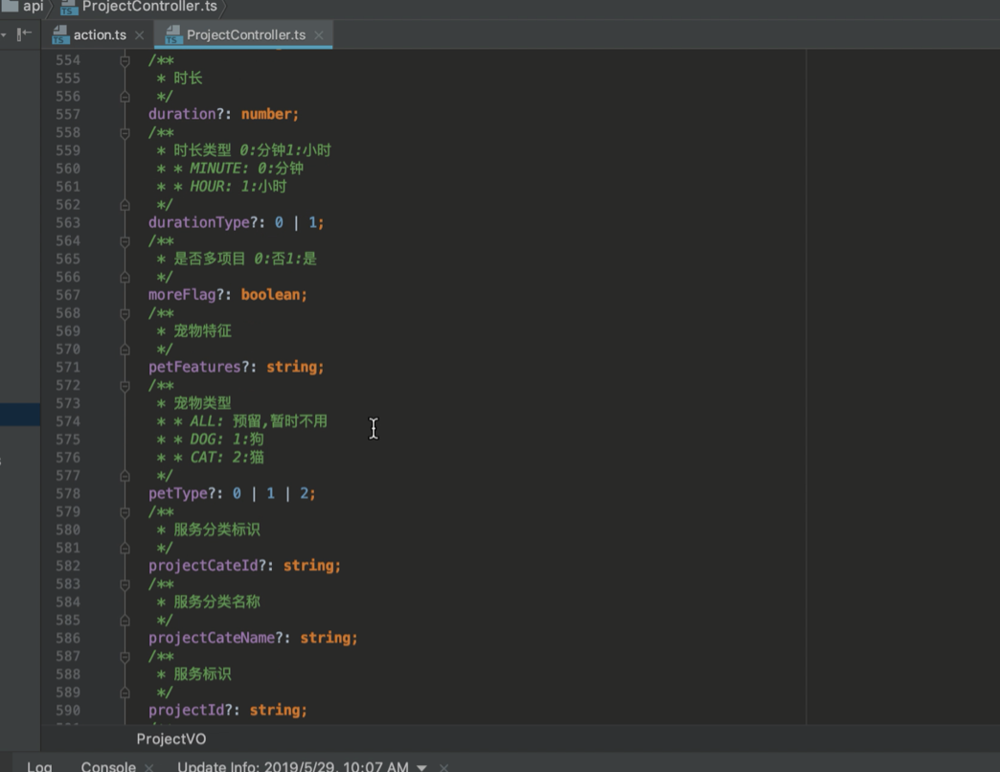
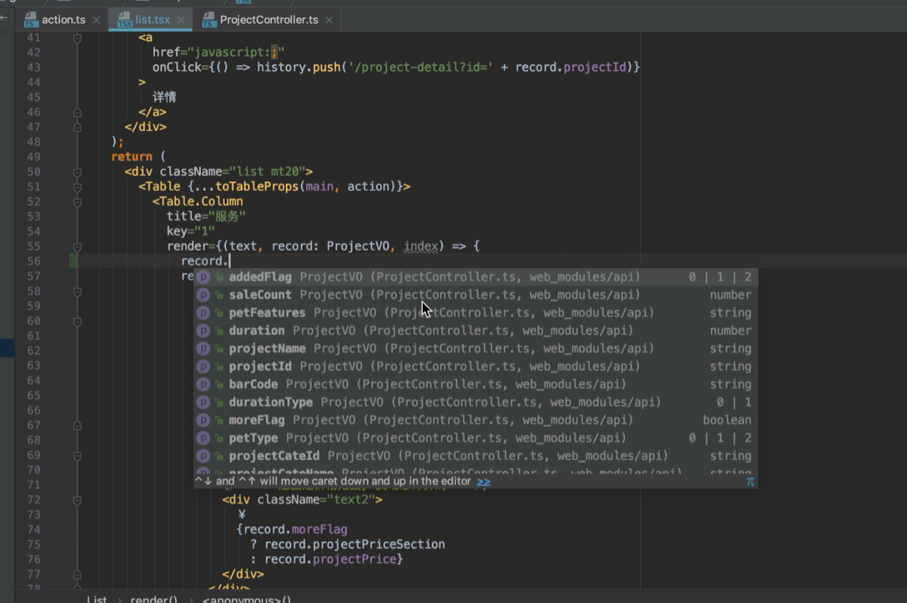
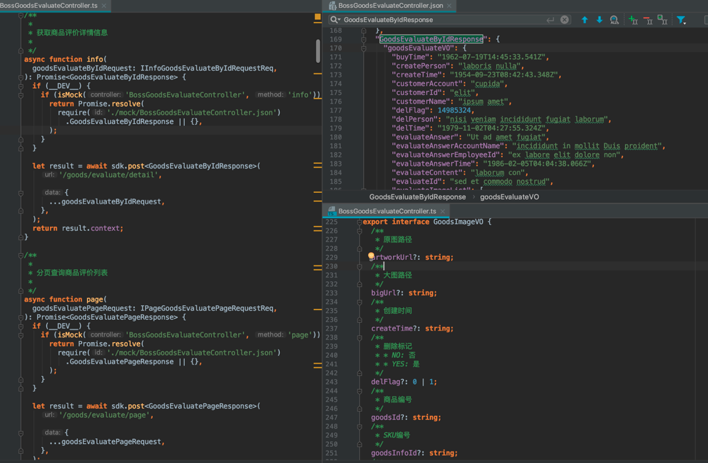
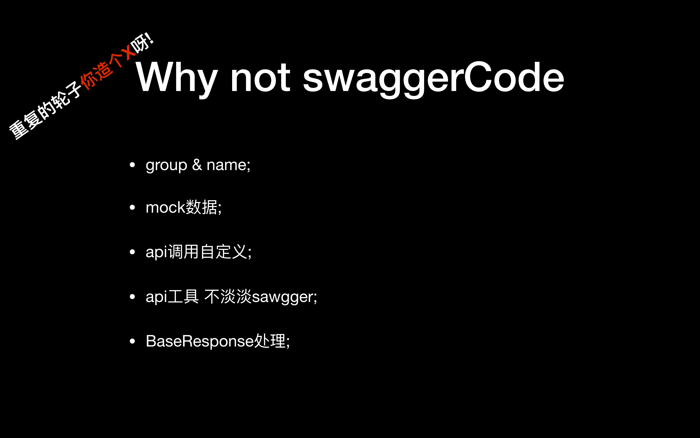

> google 10 倍工作法, 突破常规藩篱的魔法!

我们常会自嘲自己是码农,那捯饬下腻子粉更是符合我们的身份; 看到题目,大家的第一反应可能是: "腻子粉是什么?会给我们带来什么?";
腻子粉英文名称(polyfill),在前端打包编译过程中我们频繁用到,会帮助我们把浏览器间的兼容问题打平,提高我们的幸福感,再不不用关心这个 api 浏览器是否支持,再也不用关心 css 适配问题等问题.

## 是什么

在解释我们的腻子粉能带来什么前, 我们先回味下前端不那么幸福的事情?
;

### 前端的烦恼

1. 这个 res 是什么结构? - 只有程序运行起来,查看 cosole.log 或 network 我们才明天返回参数是什么.
2. 接口参数是什么? - 只有问后端接口或查看文档,才知道要传什么,发生错误,才明白 那个是必传的.
3. 今日栽树,明日填坑? - 项目开始时,质量进度总是可控的,项目进行一段时间人员轮替,可维护性下降,问题总是他人的;
4. 静待接口 - 前端依赖后端接口,联调时总会出现依赖;
5. review - 不断的 review 会议是否提升了我们的代码质量,代码可读性;
6. ts 定义何时普及 - 团队在普及 ts 时总会不尽如人意,上有对策下有政策,人性总是懒惰的,那么我们是否有更 "懒惰" 的方法普及 ts;
7. 前端总是在拖项目时间假像 - 这个一周的时间总是,第四天接口才会才可以调,如何 让我们不"拖"?
8. ctrl+c ctrl+v? - 相似的代码总是穿插在代码中(不可能把所有代码都抽组件,都复用出来-除了 0|1 的抽象),不是从之前的功能 copy 就是找官方文档 copy
   ...

### 我们想要的样子 - 你,那么美

面对这些苦恼:我们如何能够幸福! 让我们先穿越下看看我们希望的是什么样子
视频下载地址:
链接: https://pan.baidu.com/s/1Wxad7IwZkwn9fq7mOBJibg 提取码: pypw 复制这段内容后打开百度网盘手机 App，操作更方便哦

注:主要关注 api 调用 ,res,req 部分,其他部分请无视;

现在说下主要部分(图请参考下方引用):

1. 在调用 api 时有 controller(与 bff 层 1 比 1 还原)提示;
2. 在调用 controller 方法时有提示;
3. 如果不清楚方法 req 参数,点击引用直接到 ts 提示,后台备注信息我们都可以看到 (代码即文档,so sex!)
4. 如果不清楚方法 res 返回值,点击引用直接查看后台定义;
5. 在页面使用到对象的地方,总是有引用;
6. 当然,这一切是自动生成的,非人力可为;













再来看下当命令运行时生成的代码(参考下图):

1. 最左侧部分是生成的 api 调用代码
2. 右上是 对应接口的 mock 数据
3. 右下是 res/response 对应的 ts 提示;



### 项目如何落地

如果动心了,你会想问如何做到, 不动心的同学,应该是走错地方了..
要做到只有一点要求:

> 后台 bff 规范输出接口,如对接 swagger yapi 等 api 管理工具;

;

生成代码示例:

```shell
.
├── AuthorizeController.ts
├── CouponCodeBaseController.ts
├── CouponInfoController.ts
├── CustomerBaseController.ts
├── PetCouponInfoController.ts
├── StoreCustomerController.ts
├── _api-info.json
├── fetch.ts
├── index.ts
├── mock
│   ├── AuthorizeController.json
│   ├── CouponCodeBaseController.json
│   ├── CouponInfoController.json
│   ├── CustomerBaseController.json
│   ├── PetCouponInfoController.json
│   └── StoreCustomerController.json
└── mock-util.ts

1 directory, 16 files
```

ps:
当前封装的命令可以支持 swager ,yapi,如果是其他方式的要修改命令;

### feature

1. 多端覆盖 - app h5 小程序,一个都不能少;
2. TS 类型 - “零”代价引入 , 将代码即文档实践到底;
3. 代码提示 - anywhere, anyone;
4. mock 数据 - 自动生成,易于修改;
5. 智能 mock - 新添加接口自动生成 mock 数据;
6. 无侵入性 - 新老项目皆宜,无禁忌;

### 实现逻辑:

> talk is cheap ,show me the code;

[适配代码](https://github.com/creasy2010/moon/tree/master/packages/moon-wanmi)
从 swagger 下载 api 描述 JSONSCHEMA ,分组,组装数据;

[转换逻辑](https://github.com/creasy2010/moon/tree/master/packages/core/src/web-api/client)
生成调用代码,生成 req/res ts 定义 生成 mock 数据;

[项目主页](https://github.com/creasy2010/moon)
欢迎pr,众人拾柴火焰高!

## FAP:

### 什么是异步编程?

我们知道同步与异步 的区别,就好解释了.
当我实现一个功能时,阻塞干扰不间隔出现,eg: 一会接口调不通了, 一会要查文档了,一会要去喝个水.

### why not swagger-codegen?

上文提到了 swagger,有些人可能会说 为什么要重复造轮子,swagger-codegen 不是已经提供这脚本适配各平台代码了,你还造个 X 呀 !
做这个基于下面几个考虑;请容我细细列出:

1. group & name - 自定义分组,可与后端 controller 一一对应,想想几百个 controller 放到一个文件里要有多酸爽.
2. mock 数据 - 生成本地 mock 数据,简化 mock 数据流程,;
3. api 调用自定义 - 生成的代码有一个规范的 get post 等方法定义,由项目实现 http 请求或其他协议的请求;
4. api 工具 不单单 sawgger - 如 yapi 等工具也需要;
5. BaseResponse 处理 - 后端接口喜欢包装一层 baseresponse, 那么我们并不希望它出现在每个地方,我们会在 ts 定义中剥除 BaseResponse,调用的位置只用关心自己的数据;

;
